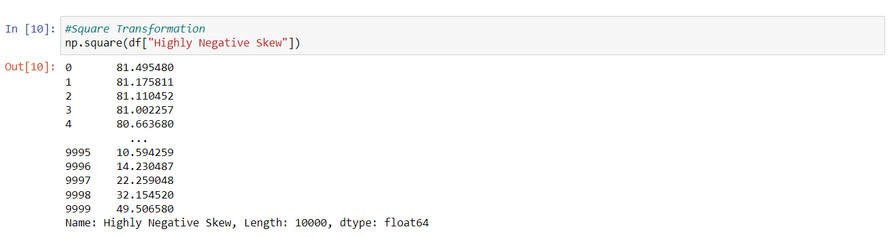
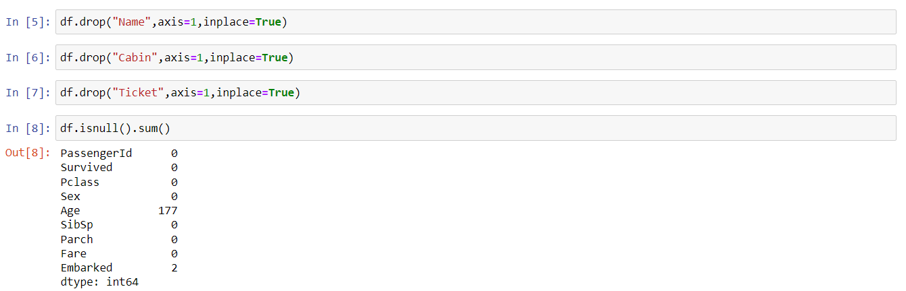
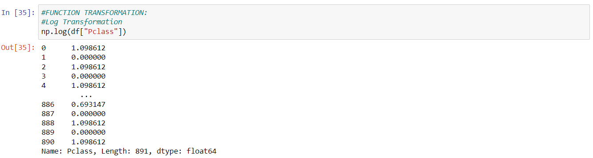
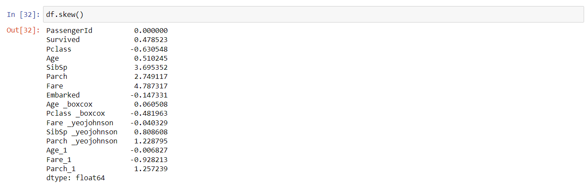

# EX-06:FEATURE TRANSFORMATION

## AIM:
To Perform the various feature transformation techniques on a dataset and save the data to a file. 

## EXPLANATION:
Feature Transformation is a mathematical transformation in which we apply a mathematical formula to a particular column(feature) and transform the values which are useful for our further analysis.
### Methods Used for Data Transformation:
1. FUNCTION TRANSFORMATION
* Log Transformation  
* Reciprocal Transformation 
* Square Root Transformation 
* Square Transformation  
2. POWER TRANSFORMATION
* Boxcox method
* Yeojohnson method
3. QUANTILE TRANSFORMATION
 
## ALGORITHM:
### STEP 1:
Read the given Data.
### STEP 2:
Clean the Data Set using Data Cleaning Process.
### STEP 3:
Apply Feature Transformation techniques to all the feature of the data set.
### STEP 4:
Save the data to the file.


## DATA SET-1:Data_To_Transform.csv:
## CODE:
```
import pandas as pd  
import numpy as np  
import matplotlib.pyplot as plt  
import seaborn as sns  
import statsmodels.api as sm  
import scipy.stats as stats  
df=pd.read_csv("Data_To_Transform.csv")  
df  
df.skew()  

#FUNCTION TRANSFORMATION:  

#Log Transformation  
np.log(df["Highly Positive Skew"])  

#Reciprocal Transformation  
np.reciprocal(df["Moderate Positive Skew"])  

#Square Root Transformation  
np.sqrt(df["Highly Positive Skew"])  

#Square Transformation  
np.square(df["Highly Negative Skew"])  

#POWER TRANSFORMATION:  

df["Highly Positive Skew_boxcox"], parameters=stats.boxcox(df["Highly Positive Skew"])  
df  

df["Moderate Positive Skew_yeojohnson"], parameters=stats.yeojohnson(df["Moderate Positive Skew"])  
df  

df["Moderate Negative Skew_yeojohnson"], parameters=stats.yeojohnson(df["Moderate Negative Skew"])  
df  

df["Highly Negative Skew_yeojohnson"], parameters=stats.yeojohnson(df["Highly Negative Skew"])  
df  


#QUANTILE TRANSFORMATION:  

from sklearn.preprocessing import QuantileTransformer   
qt=QuantileTransformer(output_distribution='normal')  

df["Moderate Negative Skew_1"]=qt.fit_transform(df[["Moderate Negative Skew"]])  
sm.qqplot(df['Moderate Negative Skew'],line='45')  
plt.show()
sm.qqplot(df['Moderate Negative Skew_1'],line='45')  
plt.show()  

df["Highly Negative Skew_1"]=qt.fit_transform(df[["Highly Negative Skew"]])  
sm.qqplot(df['Highly Negative Skew'],line='45')  
plt.show()  
sm.qqplot(df['Highly Negative Skew_1'],line='45')  
plt.show()  

df["Moderate Positive Skew_1"]=qt.fit_transform(df[["Moderate Positive Skew"]])  
sm.qqplot(df['Moderate Positive Skew'],line='45')  
plt.show()  
sm.qqplot(df['Moderate Positive Skew_1'],line='45')  
plt.show() 

df["Highly Positive Skew_1"]=qt.fit_transform(df[["Highly Positive Skew"]])  
sm.qqplot(df['Highly Positive Skew'],line='45')  
plt.show()  
sm.qqplot(df['Highly Positive Skew_1'],line='45')  
plt.show()  

df.skew()  
df 
``` 

## OUTPUT:
### Reading the given data set:

### Analyzing skewness of data:

### 1.FUNCTION TRANSFORMATION:
* Log Transformation:

* Reciprocal Transformation:

* Square Root Transformation:

* Square Transformation:

### 2.POWER TRANSFORMATION:
* Boxcox method:

* Yeojohnson method:


### 3.QUANTILE TRANSFORAMATION:


### Final Analysation of Skewness:


## DATA SET-2:Titanic dataset.csv:
## CODE:
```
import pandas as pd  
import numpy as np  
import matplotlib.pyplot as plt  
import seaborn as sns  
import statsmodels.api as sm  
import scipy.stats as stats  

df=pd.read_csv("titanic_dataset.csv")  
df  

df.drop("Name",axis=1,inplace=True)  
df.drop("Cabin",axis=1,inplace=True)  
df.drop("Ticket",axis=1,inplace=True)  
df.isnull().sum()  

df["Age"]=df["Age"].fillna(df["Age"].median())  
df["Embarked"]=df["Embarked"].fillna(df["Embarked"].mode()[0])  
df.info()  

from sklearn.preprocessing import OrdinalEncoder  
 
embark=["C","S","Q"]  
emb=OrdinalEncoder(categories=[embark])  
df["Embarked"]=emb.fit_transform(df[["Embarked"]])  

df  

#FUNCTION TRANSFORMATION:  
#Log Transformation  
np.log(df["Fare"])  

#ReciprocalTransformation  
np.reciprocal(df["Age"])  

#Squareroot Transformation:  
np.sqrt(df["Embarked"])  

#POWER TRANSFORMATION:  
df["Age _boxcox"], parameters=stats.boxcox(df["Age"])  
df  

df["Pclass _boxcox"], parameters=stats.boxcox(df["Pclass"])    
df    

df["Fare _yeojohnson"], parameters=stats.yeojohnson(df["Fare"])  
df  

df["SibSp _yeojohnson"], parameters=stats.yeojohnson(df["SibSp"])  
df  

df["Parch _yeojohnson"], parameters=stats.yeojohnson(df["Parch"])  
df  


#QUANTILE TRANSFORMATION  

from sklearn.preprocessing import QuantileTransformer   
qt=QuantileTransformer(output_distribution='normal',n_quantiles=891)  


df["Age_1"]=qt.fit_transform(df[["Age"]])  
sm.qqplot(df['Age'],line='45')  
plt.show()  

sm.qqplot(df['Age_1'],line='45')  
plt.show()  

df["Fare_1"]=qt.fit_transform(df[["Fare"]])  
sm.qqplot(df["Fare"],line='45')  
plt.show()  

sm.qqplot(df['Fare_1'],line='45')  
plt.show()  

df.skew()  
df  
```
## OUTPUT:
### Reading the given data set:

### Data Cleaning Process:



### 1.FUNCTION TRANSFORMATION:
* Log Transformation:

* Reciprocal Transformation:

* Square Root Transformation:

### 2.POWER TRANSFORMATION:
* Boxcox method:


* Yeojohnson method:


### 3.QUANTILE TRANSFORAMATION:


### Final Analysation of Skewness:



## INFERENCE:
* Log transormation is applicable only for right skewed data.
* Boxcox transformation is applicable only for positive data and yeojohnson transformation for data that contain zero or negative values.
* Reciprocal transformation is not defined for zeroes.
* Quantile transforms are a technique for transforming numerical input or output variables to have a Gaussian or uniform probability distribution.
* Square transformation is applicable for left skewed data.
## RESULT:
Hence, Feature transformation techniques is been performed on given dataset and saved into a file successfully.

